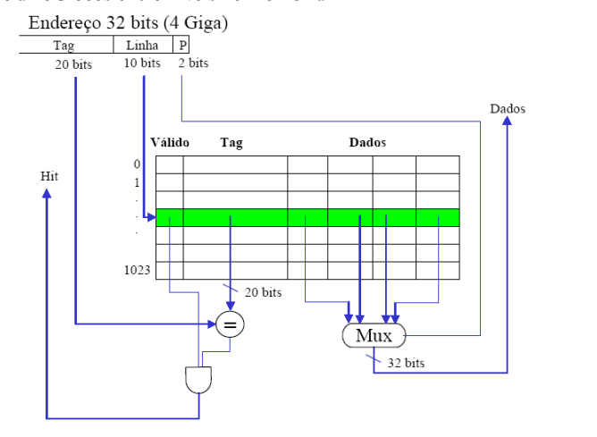
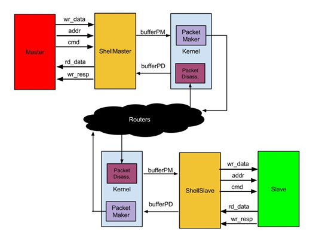

# Processador _RISC-V + Cache_ em System C

Projeto Final de Modelagem em Sistemas de Silício - 2017/1

Alunos:

* Davi Rabbouni de Carvalho Freitas - _150033010_
* Iuri de Oliveira Parada - _10/0105840_ 
* Marcos Vinicius Prescendo Tonin - _140153233_

## Tarefas

###  Implementar processador

- [X] Decode
- [X] Fetch
- [X] Execute
- [X] Breg
- [X] Teste do processador
###  Implementar uma memória cache de nível 1 (interna ao processador)

- [ ] Cache

###  Implementar uma conexão ao roteador (com criação de um módulo Shell)

- [X] Shell/ Kernel

###  Documento de Projeto

- [X] [Documento](https://docs.google.com/document/d/1UnnSHb73d-XVqGefhj3pu5bsu_rmoCDGrSrdyJ_c62I/edit)

---
## Processador RISC-V 

### Tipos de Instruções

* **Tipo R**


* Respectivas Instruções que serão implementadas

Instrução  | Opcode   | Funct7    | Funct3   | Operação                      | Implementado
:---------:| :------: | :-------: | :------: |:--------                      |:-----------:
**ADD**    | 0110011  |  0000000  |    000   |R[rd] = R[rs1] + R[rs2]        |<ul><li>- [X] </li></ul>
**SUB**    | 0110011  |  0100000  |    000   |R[rd] = R[rs1] - R[rs2]        |<ul><li>- [X] </li></ul>
**SLL**    | 0110011  |  0000000  |    001   |R[rd] = R[rs1] << R[rs2](4:0)  |<ul><li>- [X] </li></ul>
**SLT**    | 0110011  |  0000000  |    010   |R[rd] = (R[rs1] < R[rs2])? 1:0 |<ul><li>- [X] </li></ul>
**SLTU**   | 0110011  |  0000000  |    011   |R[rd] = (R[rs1] < R[rs2])? 1:0 |<ul><li>- [X] </li></ul>
**XOR**    | 0110011  |  0000000  |    100   |R[rd] = R[rs1] xor R[rs2]      |<ul><li>- [X] </li></ul>
**SRL**    | 0110011  |  0000000  |    101   |R[rd] = R[rs1] >> R[rs2](4:0)  |<ul><li>- [X] </li></ul>
**SRA**    | 0110011  |  0100000  |    101   |R[rd] = R[rs1] >> R[rs2](4:0)  |<ul><li>- [X] </li></ul>
**OR**     | 0110011  |  0000000  |    110   |R[rd] = R[rs1] OR R[rs2]       |<ul><li>- [X] </li></ul>
**AND**    | 0110011  |  0000000  |    111   |R[rd] = R[rs1] & R[rs2]        |<ul><li>- [X] </li></ul>

---

* **Tipo I**


* Respectivas Instruções que serão implementadas

Instrução  | Opcode   | Funct7    | Funct3   | Operação                             | Implementado
:---------:| :------: | :-------: | :------: |:--------                             | :-----------:
**ADDI**   | 0010011  |  -        |    000   |R[rd] = R[rs1] + imm[11:0]            |<ul><li>- [X] </li></ul>
**SLTI**   | 0010011  |  -        |    010   |R[rd] = (R[rs1] < imm[11:0])? 1:0     |<ul><li>- [X] </li></ul>
**SLTIU**  | 0010011  |  -        |    011   |R[rd] = (R[rs1] < imm[11:0])? 1:0     |<ul><li>- [X] </li></ul>
**X0RI**   | 0010011  |  -        |    100   |R[rd] = R[rs1] xor imm[11:0]          |<ul><li>- [X] </li></ul>
**ORI**    | 0010011  |  -        |    110   |R[rd] = R[rs1] OR imm[11:0]           |<ul><li>- [X] </li></ul>
**ANDI**   | 0010011  |  -        |    111   |R[rd] = R[rs1] & imm[11:0]            |<ul><li>- [X] </li></ul>
**LB**     | 0000011  |  -        |    000   |R[rd] = (byte)Mem[R[rs1] + imm[11:0]] |<ul><li>- [X] </li></ul>
**LH**     | 0000011  |  -        |    001   |R[rd] = (half)Mem[R[rs1] + imm[11:0]] |<ul><li>- [X] </li></ul>
**LW**     | 0000011  |  -        |    010   |R[rd] = Mem[R[rs1] + imm[11:0]]       |<ul><li>- [X] </li></ul>
**LBU**    | 0000011  |  -        |    110   |R[rd] = (ubyte)Mem[R[rs1] + imm[11:0]]|<ul><li>- [X] </li></ul>
**LHU**    | 0000011  |  -        |    101   |R[rd] = (uhalf)Mem[R[rs1] + imm[11:0]]|<ul><li>- [X] </li></ul>
**JALR**   | 1100111  |  -        |    000   |R[rd] = PC+4;PC = [{rs1 + Imm,0}]  ???|<ul><li>- [X] </li></ul>


* Casos Especiais (Utilizando o _shamt_)

> **shamt = rs2**

Instrução  | Opcode   | Funct7    | Funct3   | Operação                   | Implementado
:---------:| :------: | :-------: | :------: |:--------                   |:-----------:
**SLLI**   | 0010011  |  0000000  |    001   |R[rd] = R[rs1] << shamt     |<ul><li>- [X] </li></ul>
**SRLI**   | 0010011  |  0000000  |    101   |R[rd] = R[rs1] >> shamt     |<ul><li>- [X] </li></ul>
**SRAI**   | 0010011  |  0100000  |    101   |R[rd] = R[rs1] >> shamt     |<ul><li>- [X] </li></ul>

---

* **Tipo S**


* Respectivas Instruções que serão implementadas

Instrução  | Opcode   | Funct7    | Funct3   | Operação                 | Implementado
:---------:| :------: | :-------: | :------: |:--------                 |:-----------:
**SB**     | 0100011  |  -        |    000   |Mem[rs1+Imm]= R[rs2](7:0) |<ul><li>- [X] </li></ul>
**SH**     | 0100011  |  -        |    001   |Mem[rs1+Imm]= R[rs2](15:0)|<ul><li>- [X] </li></ul>
**SW**     | 0100011  |  -        |    010   |Mem[rs1+Imm]= R[rs2]      |<ul><li>- [X] </li></ul>

---

* **Tipo B**


* Respectivas Instruções que serão implementadas

Instrução | Opcode   | Funct7    | Funct3   | Operação                         | Implementado
:--------:| :------: | :-------: | :------: |:--------                         |:-----------:
**BEQ**   | 1100111  |  -        |    000   |if(R[rs1] == R[rs2]) PC= PC+4+Imm |<ul><li>- [X] </li></ul>
**BNE**   | 1100111  |  -        |    001   |if(R[rs1] != R[rs2]) PC= PC+4+Imm |<ul><li>- [X] </li></ul>
**BLT**   | 1100111  |  -        |    100   |if(R[rs1] < R[rs2]) PC= PC+4+Imm  |<ul><li>- [X] </li></ul>
**BGE**   | 1100111  |  -        |    101   |if(R[rs1] >= R[rs2]) PC= PC+4+Imm |<ul><li>- [X] </li></ul>
**BLTU**  | 1100111  |  -        |    110   |if(R[rs1] < R[rs2]) PC= PC+4+Imm  |<ul><li>- [X] </li></ul>
**BGEU**  | 1100111  |  -        |    111   |if(R[rs1] >= R[rs2]) PC= PC+4+Imm |<ul><li>- [X] </li></ul>

---

* **Tipo U**


* Respectivas Instruções que serão implementadas

Instrução  | Opcode   | Funct7    | Funct3   | Operação                      | Implementado
:---------:| :------: | :-------: | :------: |:--------                      |:-----------:
**LUI**    | 0110111  |  -        |    -     |R[rd] = {Imm,000000000000}     |<ul><li>- [X] </li></ul>
**AUIPC**  | 0010111  |  -        |    -     |R[rd] = PC+{Imm,000000000000}  |<ul><li>- [X] </li></ul>

---

* **Tipo J**


* Respectivas Instruções que serão implementadas


Instrução  | Opcode   | Funct7    | Funct3   | Operação            | Implementado
:---------:| :------: | :-------: | :------: |:--------            |:-----------:
**JAL**    | 1101111  |  -        |    -     |R[rd] = PC+4;PC=Imm  |<ul><li>- [X] </li></ul>

---

### Teste do Processador 

  Devido a falta de um gerador de linguagem de máquinas para o RISC-V através de um simulador, como por exemplo o MARS para o MIPS, foi desenvolvido uma função que tinha por finalidade gerar uma instrução de acordo com os paramêtros passados. A função será:
  
  
<kbd>uint32_t gerainst(int n, ...)</kbd> 

Sendo seu paramêtro:
* De retorno do tipo _uint32_t_ **que é um inteiro que representa o código de máquina da instrução requerida** 
* Já seus paramêtros de entrada serão _inteiros_, sendo que sempre terá 1 argumento que será **OPCODE** e outros que serão ilimitados podendo ser qualquer quantia e que, neste caso, será diferente para cada tipo.  

#### Função _gerainst_ para cada tipo


* **Tipo U** _válido para o AUIPC e LUI_

Este terá dois campos a mais que opcode, o **imediato** e o **registrador destino**, nesta ordem.

Sendo :

> gerainst(_TIPO_LUI_ ou _TIPO_AUIPC_, **Imediato**, **registrador destino**);

```
 gerainst(TIPO_LUI,931,26);
 
 > LUI $26,931;
 
 ------------------------------------------------- 
 
 gerainst(TIPO_AUIPC,931,26);
 
 > AUIPC $26,931;
 
 -------------------------------------------------
 ```

* **TIPO R**

Terá cinco campos a mais o **funct7**, o **registrador source 2**, **registrador source 1**, **funct3** e por fim **registrador destino**,nesta ordem.

Então o estilo da função será

> gerainst(_TIPO_R_,**funct7**, **registrador source 2**,**registrador source 1**,**funct3** ,**registrador destino**);

```
    
    gerainst(TIPO_R,f7_RESTO,30,12,f3_ADD_SUB,7);
     
     > ADD $7,$30,$12;
    
    -------------------------------------------------
    
    gerainst(TIPO_R,f7_SRA_SUB,23,11,f3_ADD_SUB,3);
     
     > SUB $3,$23,$11;
    
    ------------------------------------------------- 
    
    gerainst(TIPO_R,f7_SRA_SUB,7,29,f3_SRL_SRA,5);
     
     > SRA $5,$7,$29;
    
    ------------------------------------------------- 
    
    gerainst(TIPO_R,f7_RESTO,17,2,f3_SRL_SRA,17);
     
     > SRL $17,$17,$2;
    
    ------------------------------------------------- 
    
    gerainst(TIPO_R,f7_RESTO,3,4,f3_SLL,5);
     
     > SLL $5,$3,$4;
    
    -------------------------------------------------      
    
    gerainst(TIPO_R,f7_RESTO,17,19,f3_SLT,12);
     
     > SLT $12,$17,$19;
    
    -------------------------------------------------      
     
     gerainst(TIPO_R,f7_RESTO,2,2,f3_XOR,1);
     
     > XOR $1,$2,$2;
    
    -------------------------------------------------     
     
     gerainst(TIPO_R,f7_RESTO,11,1,f3_AND,22);
     
     > AND $22,$17,$2;
     
    ------------------------------------------------- 
     
     gerainst(TIPO_R,f7_RESTO,28,21,f3_OR,6);
    
    > OR $6,$28,$21;
    
    -------------------------------------------------
```

* **TIPO I** _válido para JALR_


Três campos a mais:
1.**Imediato**
2.**Registrador source 1**
3.**Funct3** 
4.**Registrador destino**.

Então o estilo da função será

> gerainst(_TIPO_I_,**imediato**, **registrador source 1**, **funct3** ,**registrador destino**);


```
     gerainst(TIPO_I2_SHAMT,10, 2, f3_ADDI, 3);
     
     > ADDI $3, $2, 10;
     
     -------------------------------------------------
     
     gerainst(TIPO_I2_SHAMT,10, 2, f3_SLTI, 3);
     
     > SLTI $3, $2, 10;
     
     -------------------------------------------------
     
     gerainst(TIPO_I2_SHAMT,10, 2, f3_SLTIU, 3);
     
     > SLTIU $3, $2, 10;
     
     -------------------------------------------------
     
     gerainst(TIPO_I2_SHAMT,10, 2, f3_XORI, 3);
     
     > XORI $3, $2, 10;
     
     -------------------------------------------------
     
     gerainst(TIPO_I2_SHAMT,10, 2, f3_ORI, 3);
     
     > ORI $3, $2, 10;
     
     -------------------------------------------------
     
     gerainst(TIPO_I2_SHAMT,10, 2, f3_ANDI, 3);
     
     > ANDI $3, $2, 10;
     
     -------------------------------------------------
     
     gerainst(TIPO_JALR,10, 2,0,3);
     
     > JALR $3, $2, 10;
     
     -------------------------------------------------


```

* **TIPO I SHAMT**
 
Outro "tipo" de instrução tipo I será deslocamento tendo seus paramêtros: 
O **funct7**, o **registrador source 2**, **registrador source 1**, **funct3** e por fim **registrador destino**,nesta ordem.

Então a instrução será

> gerainst(_TIPO_I2_SHAMT_,**funct7**, **SHAMT**,**registrador source 1**,**funct3** ,**registrador destino**);

```
     gerainst(TIPO_I2_SHAMT,f7_SRAI,10, 2, f3_SRLI_SRAI, 3);
     
     > SRAI $3, $2, 10;
     
     -------------------------------------------------
     
     gerainst(TIPO_I2_SHAMT,f7_RESTO,10, 2, f3_SRLI_SRAI, 3);
     
     > SRLI $3, $2, 10;
          
     -------------------------------------------------
   
     gerainst(TIPO_I2_SHAMT,f7_RESTO,10, 2, f3_SLLI, 3);
      
      > SLLI $3, $2, 10;
      
     -------------------------------------------------
    
```
   

* **TIPO S**

 TIPO S => imm(11-5), rs2, rs1, funct3, imm(4-0)
Terá quatro campos a mais o **imediato**, o **registrador source 2**, **registrador source 1**, **funct3**,nesta ordem.

Então o estilo da função será

> gerainst(_TIPO_S_,**imediato**, **registrador source 2**,**registrador source 1**,**funct3**);


```
     gerainst(TIPO_S,15, 2, 3, f3_SW);
     
     > SW $2, $3, 10;
     
     -------------------------------------------------
     
     gerainst(TIPO_S,15, 2, 3, f3_SH);
     
     > SH $2, $3, 10;
     
     -------------------------------------------------
     
     gerainst(TIPO_S,15, 2, 3, f3_SB);
     
     > SB $2, $3, 10;
    
     -------------------------------------------------
    
```

* **TIPO J**

Este terá dois campos a mais que opcode, o **imediato** e o **registrador destino**, nesta ordem.

Sendo :

> gerainst(_TIPO_JAL_, **Imediato**, **registrador destino**);


```
 gerainst(TIPO_JAL,255,5);
 
 > JAL $5,255;

------------------------------------------------- 
 ```


* **TIPO B**

Quatro campos a mais:
1.**Imediato**
2.**Registrador source 2**
3.**Registrador source 1** 
4.**Funct3**.

> gerainst(_TIPO_B_,**Imediato**, **registrador source 2**,**registrador source 1**,**funct3**);
```

    gerainst(TIPO_B,2314,15,21,f3_BEQ);
 
    >  BEQ $15,$21,2314;

   ------------------------------------------------- 
    
    gerainst(TIPO_B,334,1,17,f3_BNE);
    
     > BNE $1,$17,334;

    ------------------------------------------------- 

   gerainst(TIPO_B,827,4,21,f3_BLT);
    
   > BLT $4,$21,827;

   ------------------------------------------------- 

   gerainst(TIPO_B,888,5,9,f3_BGE);
    
   > BGE $5,$9,888;

   ------------------------------------------------- 

   gerainst(TIPO_B,913,19,2,f3_BLTU);
    
   > BEQ $19,$2,913;

   ------------------------------------------------- 

   gerainst(TIPO_B,1829,30,29,f3_BGEU);
 
   > BGEU $30,$29,1829;

   ------------------------------------------------- 

```
---
## Memória Cache



* **base teórica** : http://www.inf.pucrs.br/~emoreno/undergraduate/SI/orgarq/class_files/Aula12.pdf

---

## Conexão com a Network Operations Center (**NOC**)



Para os módulos como processadores, memória se conectarem com a NoC deve ser ter uma conexão passando pelo Shell e Kernel. para cada módulo IP-core.

* Shell : Especifico para cada IP-core e é responsável por adaptar os sinais de dados,controle e endereços do módulo para um formato padrão que será transmitido para outro IP-core, no caso do processador ele envia os dados para memória ou DMA . Os canais entre módulo e o shell serão e **comando**(load ou store), **endereço** e **dado**(SE FOR STORE .... se for load terá que ser recebido um dado).

* Kernel : Módulo comum para masters e slaves.

