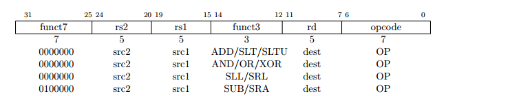
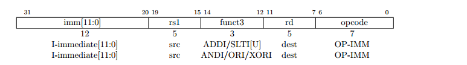
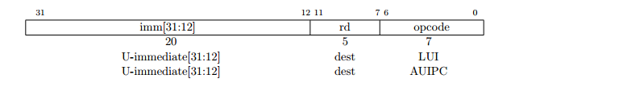
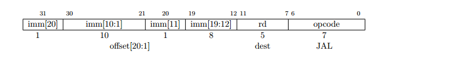

# Processador _RISC-V + Cache_ em System C

Projeto Final de Modelagem em Sistemas de Silício - 2017/1

Alunos:

* +Copyright (c) 2017 Davi Rabbouni de Carvalho Freitas
* Iuri
* Marcos Vinicius Prescendo Tonin - _140153233_

## Tarefas

###  Implementar processador

- [ ] Decode
- [ ] Fetch
- [ ] Execute
- [ ] Breg

###  Implementar uma memória cache de nível 1 (interna ao processador)

- [ ] Cache
###  Implementar uma conexão ao roteador (com criação de um módulo Shell)
- [ ] Shell/ Kernel

---
## Processador RISC-V 

### Tipos de Instruções

* **Tipo R**

* Respectivas Instruções que serão implementadas

Instrução  | Opcode   | Funct7    | Funct3   | Operação
:---------:| :------: | :-------: | :------: |:--------
**ADD**    | 0110011  |  0000000  |    000   |
**SUB**    | 0110011  |  0100000  |    000   |
**SLL**    | 0110011  |  0000000  |    001   |
**SLT**    | 0110011  |  0000000  |    010   |
**SLTU**   | 0110011  |  0000000  |    011   |
**XOR**    | 0110011  |  0000000  |    100   |
**SRL**    | 0110011  |  0000000  |    101   |
**SRA**    | 0110011  |  0100000  |    101   |
**OR**     | 0110011  |  0000000  |    110   |
**AND**    | 0110011  |  0000000  |    111   |

---

* **Tipo I**

* Respectivas Instruções que serão implementadas

Instrução  | Opcode   | Funct7    | Funct3   | Operação
:---------:| :------: | :-------: | :------: |:--------
**ADDI**   | 0010011  |  -        |    000   |
**SLTI**   | 0010011  |  -        |    010   |
**SLTIU**  | 0010011  |  -        |    011   |
**X0RI**   | 0010011  |  -        |    100   |
**ORI**    | 0010011  |  -        |    110   |
**ANDI**   | 0010011  |  -        |    111   |

* Casos Especiais (Utilizando o _shamt_)

Instrução  | Opcode   | Funct7    | Funct3   | Operação
:---------:| :------: | :-------: | :------: |:--------
**SLLI**   | 0010011  |  0000000  |    001   |
**SRLI**   | 0010011  |  0000000  |    101   |
**SRAI**   | 0010011  |  0100000  |    101   |

---

* **Tipo S**

* Respectivas Instruções que serão implementadas

Instrução  | Opcode   | Funct7    | Funct3   | Operação
:---------:| :------: | :-------: | :------: |:--------
**SB**     | 0100011  |  -        |    000   |
**SH**     | 0100011  |  -        |    001   |
**SW**     | 0100011  |  -        |    010   |

---

* **Tipo B**

* Respectivas Instruções que serão implementadas

Instrução | Opcode   | Funct7    | Funct3   | Operação
:--------:| :------: | :-------: | :------: |:--------
**BEQ**   | 1100111  |  -        |    000   |
**BNE**   | 1100111  |  -        |    001   |
**BLT**   | 1100111  |  -        |    100   |
**BGE**   | 1100111  |  -        |    101   |
**BLTU**  | 1100111  |  -        |    110   |
**BGEU**  | 1100111  |  -        |    111   |

---

* **Tipo U**

* Respectivas Instruções que serão implementadas

Instrução  | Opcode   | Funct7    | Funct3   | Operação
:---------:| :------: | :-------: | :------: |:--------
**LUI**    | 0110111  |  -        |    -     |
**AUIPC**  | 0010111  |  -        |    -     |

---

* **Tipo J**

* Respectivas Instruções que serão implementadas

Instrução  | Opcode   | Funct7    | Funct3   | Operação
:---------:| :------: | :-------: | :------: |:--------
**JAL**    | 1101111  |  -        |    -     |
**JALR**   | 1100111  |  -        |    -     |

---
